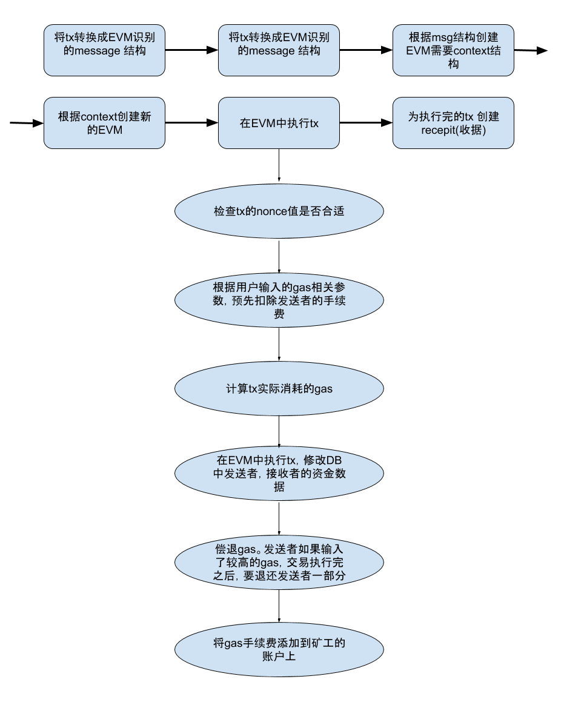

# 以太坊交易的处理过程 下篇

上篇文章讲述了一笔交易是如何在以太坊节点的本地创建,处理,发出的;今天这篇文章讲述下以太坊的矿机是如何处理接收到的交易的;交易的真正执行其实是在矿机上完成的.
矿机在eth/handler.go文件中处理接受到的消息
```
// handleMsg is invoked whenever an inbound message is received from a remote
// peer. The remote connection is torn down upon returning any error.
func (pm *ProtocolManager) handleMsg(p *peer) error {
//这里是读取从远端节点发过来的消息,确保完整接收.	
    msg, err := p.rw.ReadMsg()
	if err != nil {
		return err
	}
	if msg.Size > ProtocolMaxMsgSize { //一次接收最长的msg是10M,超过10M,就返回错误.
		return errResp(ErrMsgTooLarge, "%v > %v", msg.Size, ProtocolMaxMsgSize)
	}
	defer msg.Discard()

	// Handle the message depending on its contents
	switch {
        --
        --
        --
    	case msg.Code == TxMsg:
        //处理接收到的交易数据,保证原子操作
		if atomic.LoadUint32(&pm.acceptTxs) == 0 {
			break
		}
		// 解析交易数据,主要是rlp解码,将解码数据存到txs数组中
		var txs []*types.Transaction
		if err := msg.Decode(&txs); err != nil {
			return errResp(ErrDecode, "msg %v: %v", msg, err)
		}
		for i, tx := range txs {
			// Validate and mark the remote transaction
			if tx == nil {
				return errResp(ErrDecode, "transaction %d is nil", i)
			}
			p.MarkTransaction(tx.Hash())
		}//AddRemotes函数定义在tx_pool.go文件中,处理流程和AddLocal类似(参考上篇文章),唯一的区别是,矿机处理的交易数据大都不是本地账户发出的,这些交易数据在处理过程中不落盘.只有处理本地账户的交易数据才会落盘.经过AddRemotes处理后,矿机tx.pool的pending队列上的交易数据就准备就绪了,等待打包出块.
		pm.txpool.AddRemotes(txs)
    }
 
```
在矿机准备组装新的block的时候,会从pending队列中收集交易数据.看下面这段代码,commitNewWork函数的功能是准备下一个区块,在这个函数中完成blocke header,block body的封装;在封装完成前,要执行txpool的pending队列中的每笔交易.

```
func (self *worker) commitNewWork() {
    ---
    ---
    ---
    //获取txpool的pending队列,其实这个pending是个map的数据结构,是按照accout为key,每个accout的Transactions队列为value的大字典,包含了所有待处理的交易.每个accout的交易队列都是按照nonce值的大小排好序的.
    pending, err := self.eth.TxPool().Pending()
	if err != nil {
		log.Error("Failed to fetch pending transactions", "err", err)
		return
	}
    //NewTransactionsByPriceAndNonce函数创建了一个新的交易集合;新的交易集合实现了一个heap操作,将各个accout的交易队列的第一笔交易,按照price高低存入到了heap中.这个heap是个优先级队列,队列头永远是最小值(有点懵逼是么,等看到func (t *TransactionsByPriceAndNonce) Shift方法的时候就前后贯通了^_^)
	txs := types.NewTransactionsByPriceAndNonce(self.current.signer, pending)
    //执行这个txs交易集合中的每笔交易,获得每笔交易的状态
	work.commitTransactions(self.mux, txs, self.chain, self.coinbase)
    ---
    ---
    ---
    //用block header,交易集,交易产生的收据,状态等参数组装出一个新的block.这个block仅仅是组装完成,还没完成最后的Seal操作;
	if work.Block, err = self.engine.Finalize(self.chain, header, work.state, work.txs, uncles, work.receipts); err != nil {
		log.Error("Failed to finalize block for sealing", "err", err)
		return
	}
    ---
    ---
    ---

}

func NewTransactionsByPriceAndNonce(signer Signer, txs map[common.Address]Transactions) *TransactionsByPriceAndNonce {
	//初始化一个切片,len(txs)是account的个数.
	heads := make(TxByPrice, 0, len(txs))
	for from, accTxs := range txs {
        //将各个accout队列中的第一个交易存到heads切片中.
		heads = append(heads, accTxs[0])
		//调用Sender函数,从交易中解析出发送交易的accout,判断其是否和from一致;
		acc, _ := Sender(signer, accTxs[0])
		txs[acc] = accTxs[1:]
		if from != acc {
			delete(txs, from)
		}
	}
    //将heads初始化成一个heap优先级队列,这个队列是用最小完全二叉树实现的.root节点值最小,每个叶子节点的值都大于等于其父节点
	heap.Init(&heads)
	// Assemble and return the transaction set
	return &TransactionsByPriceAndNonce{
		txs:    txs,
		heads:  heads,
		signer: signer,
	}
}
```

讨论下commitTransactions方法做的事情,这个方法主要遍历执行了交易集合中的所有交易
```
func (env *Work) commitTransactions(mux *event.TypeMux, txs *types.TransactionsByPriceAndNonce, bc *core.BlockChain, coinbase common.Address){
if env.gasPool == nil {
//根据header.GasLimit创建gaspool, GasLimit的值和父块相关,是根据父块消耗的gas值推导计算出来的.
		env.gasPool = new(core.GasPool).AddGas(env.header.GasLimit)
	}

	var coalescedLogs []*types.Log

	for {
		//检查是否有足够的gas,进行下一笔交易的执行,如果gas不足,结束执行交易集合的循环.
		if env.gasPool.Gas() < params.TxGas {
			log.Trace("Not enough gas for further transactions", "have", env.gasPool, "want", params.TxGas)
			break
		}
		//从heap结构中获取下一笔交易;Peek方法就做了一件事情"return t.heads[0]",永远返回堆中price值最小的那笔交易.
		tx := txs.Peek()
		if tx == nil {
			break
		}
		// Error may be ignored here. The error has already been checked
		// during transaction acceptance is the transaction pool.
		//
		// We use the eip155 signer regardless of the current hf.
		from, _ := types.Sender(env.signer, tx)
	// DAO事件发生后，以太坊分裂为ETH和ETC,因为两个链上的东西一摸一样，所以在ETC上面发生的交易可以拿到ETH上面进行重放,反之亦然.所以Vitalik提出了EIP155来避免这种情况.
		if tx.Protected() && !env.config.IsEIP155(env.header.Number) {
			log.Trace("Ignoring reply protected transaction", "hash", tx.Hash(), "eip155", env.config.EIP155Block)

			txs.Pop()
			continue
		}
		// Start executing the transaction
		env.state.Prepare(tx.Hash(), common.Hash{}, env.tcount)
       //在此处执行单笔交易,稍后会展开这个函数,这个函数也是嵌套了很深,才真正执行完一笔交易
		err, logs := env.commitTransaction(tx, bc, coinbase, env.gasPool)
		switch err {
		case core.ErrGasLimitReached:
			//达到消耗gas的上限,丢弃该账户所有的交易
			log.Trace("Gas limit exceeded for current block", "sender", from)
			txs.Pop() //pop()弹出了堆栈中最小的值,因为heap中最小值存放的是正在处理的account.pop执行之后,该account从head中被删除了,这样也就不会再处理该account下的其他交易了,详情见"func (t *TransactionsByPriceAndNonce) Shift()"方法.

		case core.ErrNonceTooLow:
			//nonce值太低了,放弃当前这笔,处理该account的下一笔交易.
			log.Trace("Skipping transaction with low nonce", "sender", from, "nonce", tx.Nonce())
            //shift方法主要处理最小完全二叉树的root值,也就是heads[0];heads切片中存储了各个account的交易队列的第一笔交易,这些交易按照price值的大小组成了最小完全二叉树;交易集总是处理heads[0],处理完这笔交易后,将该account交易队列中的下一笔交易,赋值给heads[0],然后再对heap结构进行修正排序,保证heads[0]的值是所有account中最小的.
			txs.Shift()

		case core.ErrNonceTooHigh:
			//nonce值太高,丢弃该account下的所有交易队列.
			log.Trace("Skipping account with hight nonce", "sender", from, "nonce", tx.Nonce())
			txs.Pop()

		case nil:
        //交易执行正常,收集logs,把当前account交易队列中的下一笔交易移动到heads中
			coalescedLogs = append(coalescedLogs, logs...)
			env.tcount++ //执行交易总数值加1
			txs.Shift()

		default:
			// Strange error, discard the transaction and get the next in line (note, the
			// nonce-too-high clause will prevent us from executing in vain).
			log.Debug("Transaction failed, account skipped", "hash", tx.Hash(), "err", err)
			txs.Shift()
		}
	}

	if len(coalescedLogs) > 0 || env.tcount > 0 {
		//复制一份log副本,将副本通知其他模块
		cpy := make([]*types.Log, len(coalescedLogs))
		for i, l := range coalescedLogs {
			cpy[i] = new(types.Log)
			*cpy[i] = *l
		}
		go func(logs []*types.Log, tcount int) {
			if len(logs) > 0 {
				mux.Post(core.PendingLogsEvent{Logs: logs})
			}
			if tcount > 0 {
				mux.Post(core.PendingStateEvent{})
			}
		}(cpy, env.tcount)
	}
}

func (env *Work) commitTransaction(tx *types.Transaction, bc *core.BlockChain, coinbase common.Address, gp *core.GasPool) (error, []*types.Log) {
	snap := env.state.Snapshot()
    //ApplyTransaction才是真正执行一笔交易的函数;这个函数会创建交易/合约执行的EVM环境,预估交易消耗的gas,扣除交易发起方的gas,给矿工分配gas等操作.
	receipt, _, err := core.ApplyTransaction(env.config, bc, &coinbase, gp, env.state, env.header, tx, &env.header.GasUsed, vm.Config{})
	if err != nil {
		env.state.RevertToSnapshot(snap)
		return err, nil
	}
	env.txs = append(env.txs, tx)
	env.receipts = append(env.receipts, receipt)

	return nil, receipt.Logs
}
```
ApplyTransaction 函数虽然不长，但是为了完整的执行一笔交易，做了很多工作，如图所示：


看下代码
```
func ApplyTransaction(config *params.ChainConfig, bc ChainContext, author *common.Address, gp *GasPool, statedb *state.StateDB, header *types.Header, tx *types.Transaction, usedGas *uint64, cfg vm.Config) (*types.Receipt, uint64, error) {
    //将tx包含的信息转换成message结构
	msg, err := tx.AsMessage(types.MakeSigner(config, header.Number))
	if err != nil {
		return nil, 0, err
	}
	//根据msg，创建一个EVM执行的上下文环境
	context := NewEVMContext(msg, header, bc, author)
	//创建一个新的EVM，用来执行交易
	vmenv := vm.NewEVM(context, statedb, config, cfg)
	// ApplyMessage要计算gas,完成交易转账，稍后会对这个函数展开讨论。
	_, gas, failed, err := ApplyMessage(vmenv, msg, gp)
	if err != nil {
		return nil, 0, err
	}
	// Update the state with pending changes
	var root []byte
	if config.IsByzantium(header.Number) {
		statedb.Finalise(true)
	} else {
		root = statedb.IntermediateRoot(config.IsEIP158(header.Number)).Bytes()
	}
	*usedGas += gas

	// 为tx创建一个收据；
	receipt := types.NewReceipt(root, failed, *usedGas)
	receipt.TxHash = tx.Hash()
	receipt.GasUsed = gas
	// if the transaction created a contract, store the creation address in the receipt.
	if msg.To() == nil {
		receipt.ContractAddress = crypto.CreateAddress(vmenv.Context.Origin, tx.Nonce())
	}
	// 为收据创建log和布隆过滤器；
    //布隆过滤器是一种快速的哈希查找算法，它可以判断出某个元素肯定不在集合里或者可能在集合里，即它不会漏报，但可能会误报。这里用布隆过滤器可以快速的从大量的txs中查找指定的tx.
	receipt.Logs = statedb.GetLogs(tx.Hash())
	receipt.Bloom = types.CreateBloom(types.Receipts{receipt})

	return receipt, gas, err
}
```
从上面的流程图可以看出 ApplyMessage函数做了很多事情；它先创建了StateTransition结构，然后执行了这个结构的TransitionDb（）方法。
```
func (st *StateTransition) TransitionDb() (ret []byte, usedGas uint64, failed bool, err error) {
    //先在precheck函数检查这笔交易的nonce值是否合理，太大，太小都不可以。
    然后根据tx中，用户输入的gas limit，gas price等参数，预购gas，从from账户中完成扣费,该步骤通过调用buyGas()方法完成。
	if err = st.preCheck(); err != nil {
		return
	}
	msg := st.msg
	sender := vm.AccountRef(msg.From())
	homestead := st.evm.ChainConfig().IsHomestead(st.evm.BlockNumber)
	contractCreation := msg.To() == nil

	//计算该笔交易实际需要消耗的gas。IntrinsicGas函数执行流程如下：
    1、判断tx是合约还是普通转账交易；合约交易的gas limit起步价是53000；普通交易起步价21000
    2、计算tx占用的字节长度；统计tx中非零字节的总长度，和零字节的总长度；因为计费标准不一样；非零字节每字节68个gas,零字节每字节4个gas。二者相加计算出消耗的总的gas数。
    3、gas数量 乘以 gas price就是要支付的手续费；如果用户想要快速的把自己的交易发送出去，适当的提高gas price,矿工的tx pool会对price较高的交易优先打包的。这点在上篇中提到过。
	gas, err := IntrinsicGas(st.data, contractCreation, homestead)
	if err != nil {
		return nil, 0, false, err
	}
    //如果预购的gas小于要消耗的gas，这里返回一个error:"out of gas".
	if err = st.useGas(gas); err != nil {
		return nil, 0, false, err
	}

	var (
		evm = st.evm
		// vm errors do not effect consensus and are therefor
		// not assigned to err, except for insufficient balance
		// error.
		vmerr error
	)
	if contractCreation {
		ret, _, st.gas, vmerr = evm.Create(sender, st.data, st.gas, st.value)
	} else {
		//增加from账户的nonce值，为下一笔交易做准备。
		st.state.SetNonce(msg.From(), st.state.GetNonce(sender.Address())+1)
		//Call()方法在完成转账交易，调用执行了下面2行	
        // db.SubBalance(sender, amount)
	    // db.AddBalance(recipient, amount)
        
        ret, st.gas, vmerr = evm.Call(sender, st.to(), st.data, st.gas, st.value)
	}
	if vmerr != nil {
		log.Debug("VM returned with error", "err", vmerr)
		// The only possible consensus-error would be if there wasn't
		// sufficient balance to make the transfer happen. The first
		// balance transfer may never fail.
		if vmerr == vm.ErrInsufficientBalance {
			return nil, 0, false, vmerr
		}
	}
    //退税，退税是为了奖励大家运行一些能够减轻区块链负担的指令。
    这里会把用户剩下的gas，以及退税的gas(退税的gas不会超过消耗gas总额的1/2)总和返回给     from账户
	st.refundGas()
    //给矿工的账户添加gas手续费。
	st.state.AddBalance(st.evm.Coinbase, new(big.Int).Mul(new(big.Int).SetUint64(st.gasUsed()), st.gasPrice))

	return ret, st.gasUsed(), vmerr != nil, err
}
```
交易到这里就算执行完成了。这里只是阐述了为了执行一笔tx要经过哪些流程，没过多描述EVM的执行细节。所有交易执行完成后会打包上块。区块最终会被矿工广播出去。广播出去的区块，也要经过其他节点的验证，验证无误后才会插入到本地的链上。验证的时候也要调用到ApplyTransaction函数。
其他节点同步区块的代码调用栈如下,供大家参考：

```
pm.syncer()
pm.synchronise(pm.peers.BestPeer())
pm.downloader.Synchronise(peer.id, pHead, pTd, mode)
d.synchronise(id, head, td, mode)
d.syncWithPeer(p, hash, td)   
func (d *Downloader) processFastSyncContent(latest *types.Header)
func (d *Downloader) importBlockResults(results []*fetchResult)
d.blockchain.InsertChain(blocks)
func (bc *BlockChain) InsertChain(chain types.Blocks) (int, error)
       bc.insertChain(chain)
func (p *StateProcessor) Process(block *types.Block, statedb *state.StateDB, cfg vm.Config) (types.Receipts, []*types.Log, uint64, error)
   ApplyTransaction()
```